# Self-Healing Playwright Agent 🤖🏥

> A resilient test automation wrapper that uses Generative AI (OpenAI or Google Gemini) to automatically fix broken selectors at runtime.


## ✨ Features

| Feature                   | Description                                                 |
| ------------------------- | ----------------------------------------------------------- |
| 🔧 **AI Self-Healing**    | Automatically fixes broken selectors using OpenAI or Gemini |
| 🔄 **Provider Fallback**  | Automatically switches between Gemini/OpenAI on rate limits |
| 🌐 **Multi-Browser**      | Chromium, Chrome, Firefox, Safari, Edge + Mobile devices    |
| 🌍 **Multi-Environment**  | Dev, Staging, Prod configs with `.env.{env}` files          |
| 📊 **Structured Logging** | Winston logger with console + file output                   |
| 📄 **Page Object Model**  | Clean POM architecture with proper page flows               |
| 🔄 **CI/CD Ready**        | GitHub Actions with retries and HTML reports                |

## 🚀 Quick Start

```bash
# Install dependencies
npm install

# Run tests (production environment)
npm run test:prod

# Run the Self-Healing Demo specifically
npm run test:healing-demo

# Run on specific browser
npm run test:firefox
npm run test:webkit
```

## 🌍 Multi-Environment Support

```bash
# Development (visible browser, debug logging)
npm run test:dev

# Staging
npm run test:staging

# Production (headless, minimal logging)
npm run test:prod
```

**Environment files:**

- `.env.dev` - Development configuration
- `.env.staging` - Staging configuration
- `.env.prod` - Production configuration
- `.env.example` - Template with all available options

## 🌐 Cross-Browser Testing

| Project         | Browser/Device |
| --------------- | -------------- |
| `prod`          | Desktop Chrome |
| `chromium`      | Chromium       |
| `chrome`        | Google Chrome  |
| `firefox`       | Firefox        |
| `webkit`        | Safari         |
| `edge`          | Microsoft Edge |
| `mobile-chrome` | Pixel 5        |
| `mobile-safari` | iPhone 12      |
| `tablet`        | iPad (gen 7)   |

```bash
# Run on all browsers
npm run test:all-browsers
```

## 🔧 Configuration

### Environment Variables

Create a `.env.prod` file (or copy from `.env.example`):

```bash
# Environment
ENV=prod
BASE_URL=https://www.gigantti.fi/

# AI Provider (gemini or openai)
AI_PROVIDER=gemini
GEMINI_API_KEY=your_gemini_key_here
GEMINI_MODEL=gemini-flash-latest

# Or use OpenAI
OPENAI_API_KEY=sk-your-openai-key
OPENAI_MODEL=gpt-4o

# Logging
LOG_LEVEL=warn

# Test Configuration
TEST_TIMEOUT=120000
HEADLESS=true
```

## 🐳 Run with Docker

You can run the tests in a containerized environment to ensure consistency.

### 1. Build & Run

```bash
# Build the image
docker-compose build

# Run the tests
docker-compose up
```

### 2. View Reports

Start a local web server to view the report generated inside the container:

```bash
npx playwright show-report playwright-report
```

## Technical Notes

```
src/
├── AutoHealer.ts              # Core AI healing logic
├── config/
│   ├── index.ts               # Centralized configuration
│   └── locators.json          # Persistent selector storage
├── pages/
│   ├── BasePage.ts            # Abstract base page
│   ├── GiganttiHomePage.ts    # Entry point
│   ├── CategoryPage.ts        # Product listings
│   └── ProductDetailPage.ts   # Product details
└── utils/
    ├── Environment.ts         # Multi-env loader
    ├── Logger.ts              # Winston wrapper
    ├── LocatorManager.ts      # Selector persistence
    └── SiteHandler.ts         # Overlay dismissal (Strategy pattern)

tests/
├── gigantti.spec.ts           # E2E tests
├── healing-demo.spec.ts       # Self-healing demo tests
└── fixtures/base.ts           # Playwright fixtures
```

## 🔄 CI/CD

GitHub Actions workflow runs on every push:

- ✅ Unit tests with code coverage reporting
- ✅ E2E tests on **all 9 browser configurations** (matrix strategy)
- ✅ HTML report artifacts
- ✅ Automatic retries for flaky tests

## 🧬 Architecture — How Self-Healing Works

```mermaid
sequenceDiagram
    participant Test
    participant AutoHealer
    participant Page
    participant AI

    Test->>AutoHealer: click("#old-btn")
    AutoHealer->>Page: page.click("#old-btn")
    Page-->>AutoHealer: ❌ TimeoutError
    AutoHealer->>Page: getSimplifiedDOM()
    Page-->>AutoHealer: cleaned HTML
    AutoHealer->>AI: Find new selector
    AI-->>AutoHealer: "#new-btn"
    AutoHealer->>Page: page.click("#new-btn")
    Page-->>AutoHealer: ✅ Success
    AutoHealer->>AutoHealer: updateLocator
```



## 📝 How It Works

```typescript
// AutoHealer intercepts failures and uses AI to recover
// The AI returns the plain CSS selector as a string
async click(selector: string) {
  try {
    await this.page.click(selector);
  } catch (error) {
    // Ask AI for a new replacement selector
    const result = await this.heal(selector, error);
    if (result && result.selector !== 'FAIL') {
      await this.page.click(result.selector);
    }
  }
}
```

_Note: If the primary AI Provider (e.g. Gemini) hits a 4xx Rate Limit error, the `AutoHealer` automatically detects the quota failure and falls back to an alternate AI Provider (e.g. OpenAI) if configured!_

## 📚 Portfolio Notes

This project demonstrates:

- **Agentic Workflows**: Combining LLMs with deterministic runtime logic
- **Enterprise Architecture**: Multi-environment, structured logging, centralized config
- **Modern QA**: Moving beyond "record and playback" to intelligent, resilient automation
- **Cross-Browser Testing**: Full coverage across desktop and mobile devices

## 🎯 Best Practices

### Type Safety

The framework uses strict TypeScript with comprehensive type definitions:

```typescript
import { AutoHealer, type ClickOptions, type FillOptions } from './AutoHealer';

// Fully typed interactions
await healer.click('#button', { timeout: 3000 });
await healer.fill('#input', 'value', { force: true });
```

### Code Quality

Includes industry-standard tooling:

- **ESLint**: Enforces code quality and best practices
- **Prettier**: Ensures consistent formatting
- **TypeScript**: Strict type checking with no implicit any
- **Vitest**: Fast unit testing with coverage reports

```bash
# Run all quality checks
npm run validate

# Auto-fix issues
npm run lint:fix
npm run format
```

### Security

- API keys managed through environment variables
- No secrets in source code
- Automatic key rotation support
- CodeQL security scanning
- See [SECURITY.md](SECURITY.md) for full guidelines

### Testing

Comprehensive test coverage with unit tests for all core functionality:

```bash
npm run test:unit          # Run tests
npm run test:unit:watch    # Watch mode
npm run test:coverage      # With coverage
```

### Documentation

- JSDoc comments on all public APIs
- Type definitions for IDE auto-completion
- Usage examples in code
- Comprehensive guides in [CONTRIBUTING.md](CONTRIBUTING.md)

## 🤝 Contributing

We welcome contributions! Please see [CONTRIBUTING.md](CONTRIBUTING.md) for guidelines.

## 🔒 Security

For security concerns, please see [SECURITY.md](SECURITY.md).

## 📄 License

ISC
